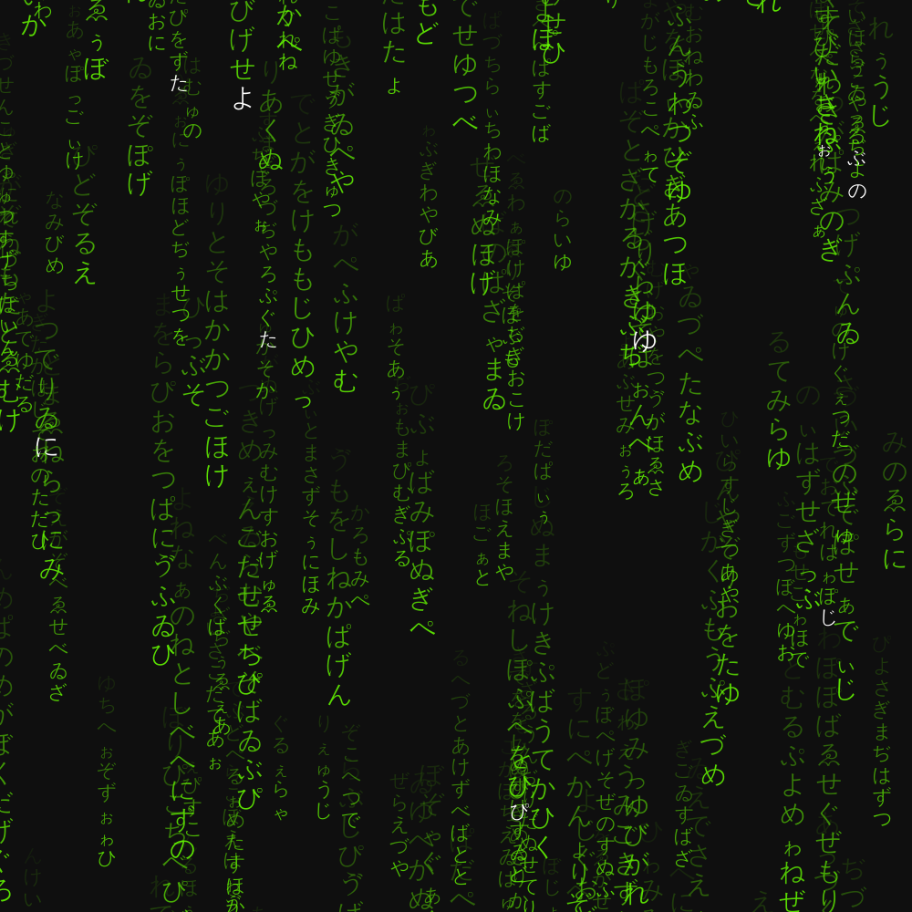

# Matrix

As countless times in the past, I made this a long time ago and promptly forgot to even make this public.
According to GitHub, this repo has been created Jul 25, 2021.

Anyway, since I watched Matrix, my life has not been the same.
*Not really*, but I finally felt authorized to make a letter-falling rendition of the Matrix in JavaScript.
Previously I had made a [bash version that could fit into a QR](https://github.com/lorossi/shell-matrix), but it was lacking the high quality, perfect looping quality that this product has.

The letters are selected randomly from Unicode value 0x3041 to 0x3094, which corresponds to the [Hiragana Script](https://en.wikipedia.org/wiki/Hiragana_(Unicode_block)).
I honestly have no idea where they do come from or where they are used but most of all I hope I did not create any swear word by accident *(I swear, the letters are picked at random!)*.

If you want to see it, check out my [Instagram profile](https://www.instagram.com/p/ChrqGTQKRfL/) or scroll down a bit for a low quality, choppy gif and some stills.
If you are still interested, visit [this link](https://github.com/lorossi/js-matrix) to try it on your own!

## Rendered video

## Credits

This project is distributed under Attribution 4.0 International (CC BY 4.0) license.
